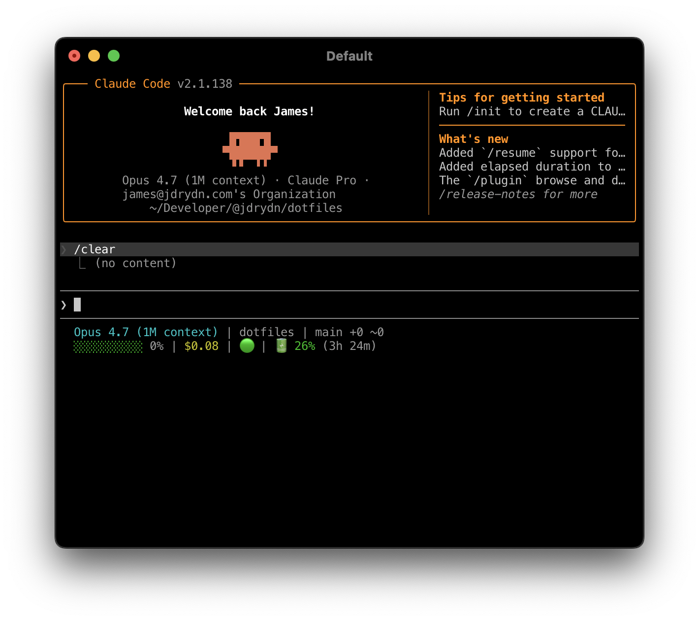

# Claude Code

My [Claude Code](https://claude.com/claude-code) config, installed into `~/.claude/` via symlinks.

## Install

```sh
./setup.sh
```

Idempotent — re-run any time. Symlinks everything below, cleans up dead links into this repo, and rebuilds the
concatenated global `CLAUDE.md`. See [`CLAUDE.md`](./CLAUDE.md) for what it does and how to extend it.

## Contents

```yml
# Numbered parts of the global instruction set, concatenated (in glob order)
# into ~/.claude/CLAUDE.md. Numeric prefixes control order; leave gaps for inserts.
# *.local.md files are private to the specific machine setup (e.g. work laptop)
- CLAUDE.md.d/:
    - 10-Introduction.md # An introduction to the user
    - 20-Security.md # Safety precautions for Claude to consider
    - 30-Compaction.md # A style for compaction to try to promote efficiency
    - 40-Communication-Style.md # How to write back to the user
    - 45-Integrations.local.md # Private notes for specific MCP servers and integrations
    - 50-Behaviours.md # Quirks and behaviours the user prefers
    - 51-Behaviours.local.md # Private behaviour notes

# Shared global agents, symlinked per-file into ~/.claude/agents/<name>.md
- agents/: # none yet

# Rules, symlinked as a whole folder to ~/.claude/rules/dotclaude
# so they co-exist with rules from other sources.
- rules/:
    - aws-sts-get-caller-identity.md # Resolve the AWS account/region natively, never hardcode
    - gh-workflows-pinning.md # Pin GitHub Actions workflows to commit SHAs
    - typescript.md # Notes for working with Typescript code

# Skills, symlinked per-folder into ~/.claude/skills/<name>.
# Each has a SKILL.md (the procedure) and a README.md (what it's for, with an example).
# Skills named local-* are private (gitignored) but linked the same way, and aren't listed here.
- skills/:
    - commit # Git commit workflow
    - context-joke # Context-aware joke
    - gh-pr-consider-comments # Work through unresolved PR review threads, discussion-first
    - gh-pr-review # Review a PR: verify-don't-trust, numbered findings, clear verdict
    - grill-me # Interrogate a loose idea until it can be committed to
    - grill-proj # As above, with the codebase read first and every question grounded in it
    - init2 # Generate a project CLAUDE.md
    - knowledge-interview # Interview the user, then draft the doc in the right shape
    - pull-request # Open a PR via gh CLI

# Copied to ~/.claude/ on first run (NOT symlinked), to allow edits per-machine.
# setup.sh never overwrites these once present.
- settings.json # Permissions, allowed commands, hooks, etc.
- statusline-command.sh # Custom statusline (screenshot below)
```



## References

- [How CLAUDE.md files load](https://code.claude.com/docs/en/memory#how-claude-md-files-load)
- [User-level Claude rules](https://code.claude.com/docs/en/memory#user-level-rules)
- [Common workflows](https://code.claude.com/docs/en/common-workflows)
